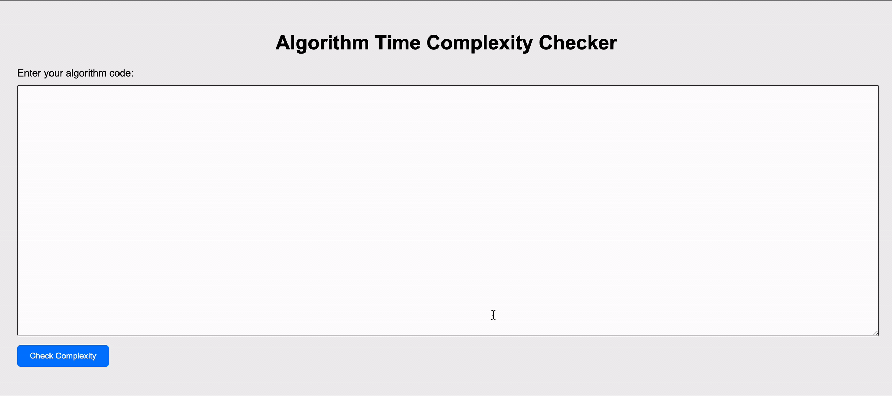

# Algorithm Time Complexity Calculator

This is a private app that calculates the time complexity of algorithms. Given an algorithm, the app will analyze the code and determine its time complexity, which is an important metric for evaluating the efficiency of the algorithm.

## How to Use

To use the app, simply enter the code for the algorithm you want to analyze into the input field and click the "Check Complexity" button. The app will analyze the code and display the time complexity in big O notation.

## Features

The app has the following features:

- Simple user interface for entering algorithm code and displaying time complexity
- Supports any programming language
- Uses a variety of techniques to analyze algorithms, including counting loops and branches, tracking variable assignments, and more
- Allows users to compare the time complexity of different algorithms and choose the most efficient one

## Access

This app is only accessible to authorized users. To gain access, please contact the app administrator.

## License

[LICENSE](WTFPL)
